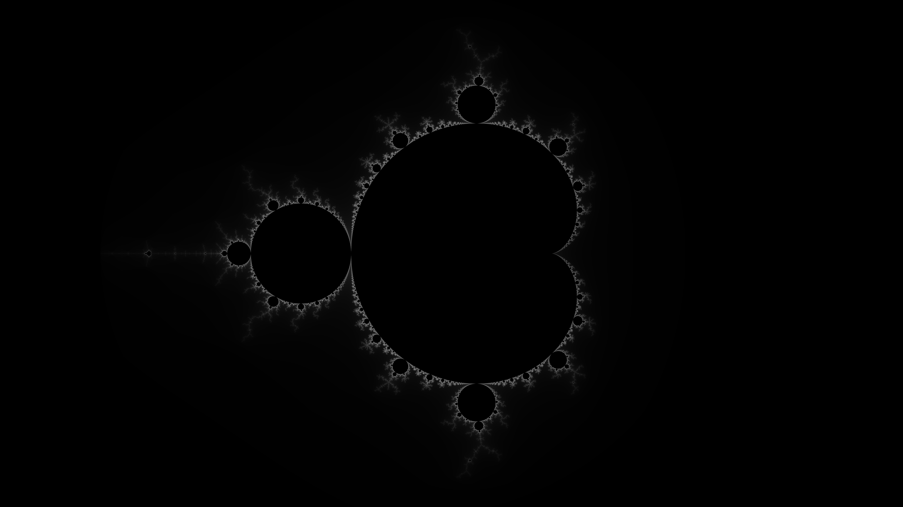

# Mandelbrot-rs

Simple Mandelbrot fractal generator developped in Rust for training purposes.

## Gallery

**Complete Mandelbrot set**


coords: `( re: -2.5, im: 1.25), size: 4.5`

**Near the "Valley of seahorses"**


coords: `( re: -1.0, im: 0.33), size: 0.5`


## Requirements
One of:
- rustc compiler + cargo : [Install instructions](https://github.com/rust-lang-nursery/rustup.rs)
- Docker (tested on 19.03.1-ce)


## Build

```sh
git clone https://github.com/Xide/mandelbrot-rs.git
cd mandelbrot-rs
```

> With Cargo

```sh
cargo build --release
./target/release/mandelbrot --help
```

> With Docker
```sh
docker build -t mandelbrot .
docker run -it mandelbrot --help
```

## Usage

```

# mandelbrot --help

# valley of seahorses example

## With binary
mandelbrot -r 1920x1080 -a 8 -i 5000 -o seahorses.png -s "(-1.0, 0.33)" -w 0.5

## With Docker
docker run -it sigbilly/mandelbrot:master -r 1920x1080 -a 8 -i 5000 -o seahorses.png -s "(-1.0, 0.33)" -w 0.5

```

## Todo
- Optimization: cycle checking in divergence test
- Incremental / resumable fractal computation
- Interface: Dynamic exploration of the set
- Image: Add color methods / custom colors
- Cli: shortcuts for common resolutions
- Corresponding Julia set explorer ?
- Video generation ?
s